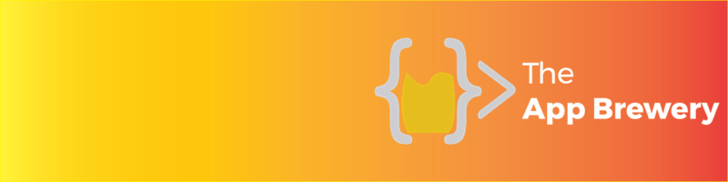

## What did i learn

* How to clone an existing Xcode project from GitHub.
* Create an app with behaviour and functionality.
* Create links between the Interface Builder files and code using IBActions and IBOutlets.
* Get familiar with the Xcode code editor.
* * Learn to use comments to annotate code.
* Understand and use Swift constants and variables.
* Understand and use collection types such as Swift arrays.
* Test and debug your app with the Xcode console.
* Learn about randomisation and how to generate random numbers in Swift.

